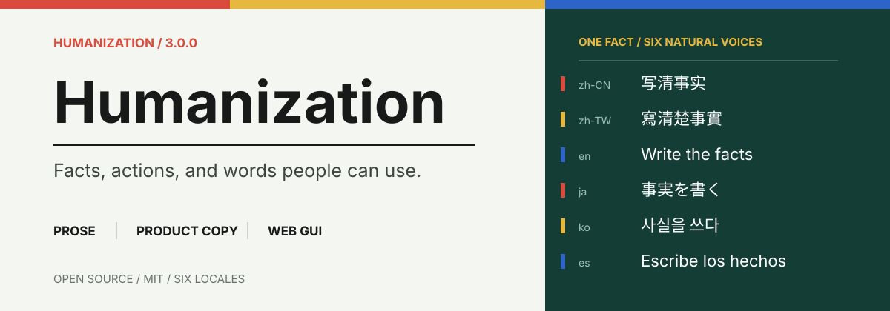

<p align="center">
  
</p>

<p align="center">
  <a href="https://github.com/KKKKhazix/human-writing/releases/tag/v1.1.0"></a>
  <a href="./LICENSE"></a>
  <a href="https://github.com/KKKKhazix/human-writing/releases/latest"></a>
</p>

<p align="center">
  <a href="#快速安装">快速安装</a> ·
  <a href="#它做什么">写作流程</a> ·
  <a href="#仓库结构">仓库结构</a> ·
  <a href="https://github.com/KKKKhazix/human-writing/issues">提交问题</a>
</p>

> AI 写中文有个通病：读完觉得挺流畅，但说不出是谁写的。活人感写作想治的就是这件事。

让模型写出来的文章读起来像一个具体的人在说话——知道一些事，有判断，偶尔岔开一句，还能接回来。适用于知乎回答、公众号文章、博客、论坛帖、人物故事、科普、评测、小说、口播等大多数中文写作场景。

## 它做什么

写作之前先解决一个前置问题：你手上有没有东西可写。

现实题材，材料不够就去查，查不到就追问或者缩短篇幅，绝不拿车轱辘话凑字数。虚构题材可以自由创造人物和情节，但每个场景仍然要有目标、有动作、有变化。

材料过关之后管三件事：

| 材料 | 推进 | 中文 |
| :--- | :--- | :--- |
| 现实写作核准事实、数字、引语和亲历。虚构写作检查人物、行动与因果。 | 每段都要带来新东西——新事实、新动作、新例子或新后果。写过的不重复。 | 白话打底，在意词序和停顿，清掉报告腔、模型腔和翻案句。 |

初稿写完还有一道关。Skill 会逐段检查有没有在原地转圈，砍掉重复解释，调整长短句节奏，拦住冒号滥用、破折号、「不是……而是……」之类的翻案腔和常见 AI 黑话。检查脚本只管已经写明的硬规则，不替你决定风格。

## 快速安装

把下面这句话发给你的 Agent。

```bash
帮我安装这个skill：https://github.com/KKKKhazix/human-writing
```

Agent 会读取仓库、找到 `human-writing`，完成安装。装好之后显示名为「活人感写作」。

<details>
<summary><strong>Agent 不支持直接安装时</strong></summary>

从 [Releases](https://github.com/KKKKhazix/human-writing/releases/latest) 下载，或者把仓库里的 [`human-writing`](./human-writing) 文件夹完整复制到本机 Skills 目录。文件夹名保留 `human-writing`。

```text
~/.agents/skills/human-writing/
```

</details>

装好之后这样用：

```text
使用 $human-writing，把我的材料写成一篇有活人感和中文韵律的作品。
```

## 1.1.0 改了什么

1.0 用字符串禁令拦 AI 味——禁「不是……而是……」、禁冒号、禁一批黑话。有效，但模型会换一套字面继续做同样的事。「你以为……其实……」「回头才发现」和「不是A而是B」是同一个姿势，读者认的是姿势，不是字。

1.1 把防线从字面挪到动作：禁的是「先给读者立一个他没有的误解，再推翻它」这件事本身，不管穿什么外衣。检测脚本也跟着升级，补了变形翻案句、AI 排比、抒情借喻的警告层，加了句长变异系数和连词密度的统计检查，同时把「不丢人」「打法」这类正常中文从误伤名单里捞出来。另外出了一个两千字的蒸馏版，ChatGPT、千问这类聊天窗口直接粘贴就能用。

完整变更见 [CHANGELOG.md](./CHANGELOG.md)。

## 仓库结构

<details>
<summary><strong>展开查看完整目录</strong></summary>

```text
human-writing/
├── SKILL.md
├── VERSION
├── LICENSE
├── agents/
│   └── openai.yaml
├── dist/
│   └── human-writing-lite.md
├── references/
│   ├── forum-prose.md
│   ├── reality.md
│   ├── fiction.md
│   ├── formats.md
│   └── revision.md
└── scripts/
    └── check_prose.py
```

| 位置 | 干什么的 |
| :--- | :--- |
| [`SKILL.md`](./human-writing/SKILL.md) | 入口。材料门槛、现实与虚构分流、写作流程、交付禁令，全在这一份里 |
| [`forum-prose.md`](./human-writing/references/forum-prose.md) | 知乎、公众号、论坛长帖的写法，节奏和措辞的具体做法都在这里 |
| [`reality.md`](./human-writing/references/reality.md) | 真人、历史、新闻、数据和个人经历的事实边界 |
| [`fiction.md`](./human-writing/references/fiction.md) | 小说、故事、虚构散文和对白的创作规则 |
| [`formats.md`](./human-writing/references/formats.md) | 短内容、口播、演讲、教程、评测等特殊形式 |
| [`revision.md`](./human-writing/references/revision.md) | 初稿写完之后怎么改——逐遍检查清单 |
| [`check_prose.py`](./human-writing/scripts/check_prose.py) | 检查成稿有没有踩到硬禁令 |
| [`human-writing-lite.md`](./human-writing/dist/human-writing-lite.md) | 蒸馏版，两千字以内，聊天窗口直接粘贴用 |

</details>

## 反馈

MIT 协议开源。仓库只有原创规则和工具，没有第三方文章、训练语料或模型权重。

碰到规则冲突、误报或者某个模型上表现不对，欢迎[提 Issue](https://github.com/KKKKhazix/human-writing/issues)。附上你的提示词、模型输出片段和你觉得应该是什么样，排查起来快很多。

<p align="center">
  <sub>活人感写作 · Human Writing · 1.1.0</sub>
</p>
